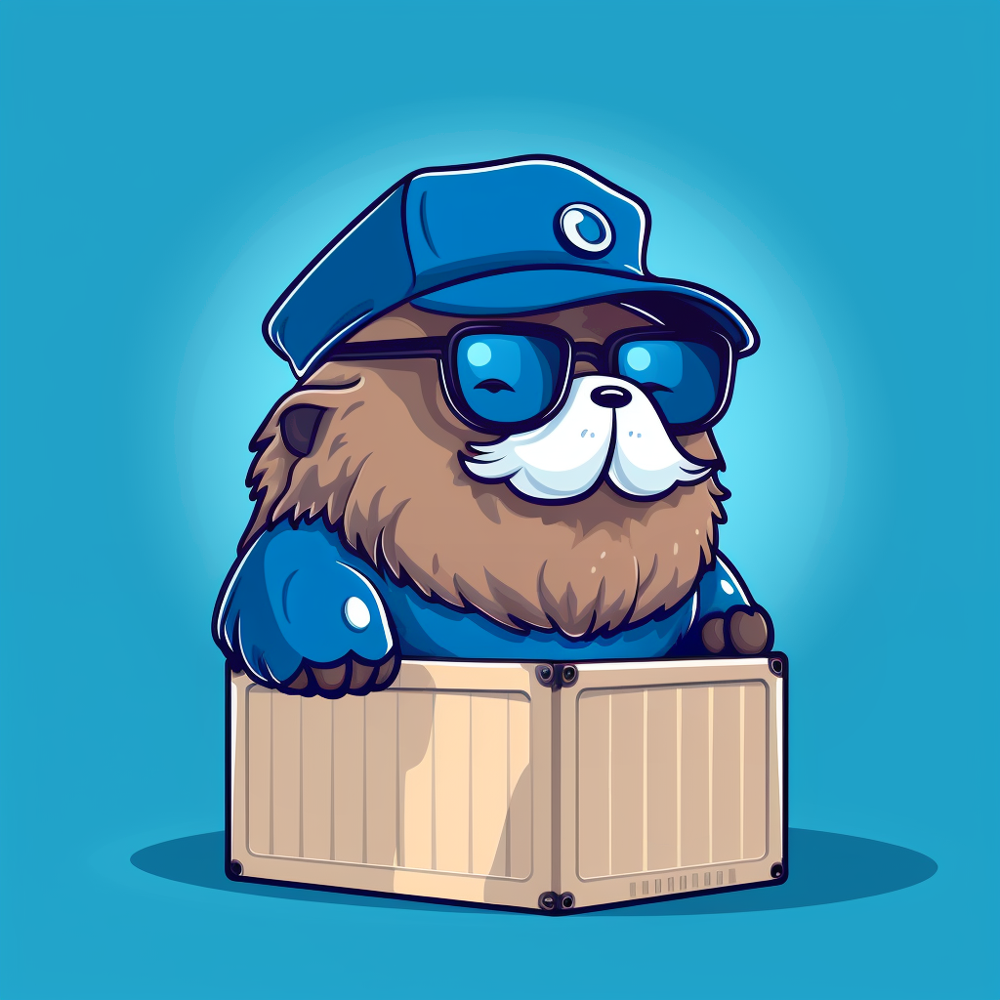

# Gordon

<div align="center">
  
  <h3>The Smart Way to Deploy Containers on Your VPS</h3>
  <p><em>Push code → Auto-deploy → Zero complexity</em></p>
</div>

## Why Gordon?

**You have a $5 VPS. You want to run multiple apps. You don't want Kubernetes.**

Gordon is the missing piece that makes container deployment on budget VPS servers as simple as expensive PaaS solutions. One binary, one config file, unlimited apps.

### 🎯 Perfect For

- **Solo developers** with multiple side projects on one VPS
- **Small teams** who want Heroku-like simplicity without the cost
- **Agencies** deploying client apps across VPS servers
- **Anyone** tired of complex deployment pipelines

## 🚀 How It Works

### Build Locally, Deploy Instantly

```bash
# 1. Build & test on YOUR machine
podman build -t myapp .
podman run -p 8080:8080 myapp  # Works? Great!

# 2. Push to deploy
podman tag myapp registry.yourdomain.com/myapp:latest
podman push registry.yourdomain.com/myapp:latest

# 3. That's it. Gordon deploys it automatically.
```

**No build servers. No CI/CD complexity. If it runs on your machine, it runs in production.**

### 🔄 Instant Rollbacks

Something broke? Just change your config:

```toml
# Before (in gordon.toml)
"app.yourdomain.com" = "myapp:latest"

# After - instant rollback!
"app.yourdomain.com" = "myapp:v1.2.3"
```

Save the file. Gordon redeploys the previous version. Problem solved in seconds.

## ✨ Key Features

### 🏠 Local-First Development
**Your machine is the build server.** Test locally with Podman's rootless containers, push when ready. No waiting for remote builds.

### 🏦 Built-in Container Registry
Your VPS becomes a private container registry (Docker/Podman compatible). No Docker Hub subscription needed.

### 🔄 Push-to-Deploy Magic
Gordon watches for new images and deploys them instantly to configured domains.

### ⏮️ Version Control Built-In
Keep multiple versions in your registry. Switch between them instantly by editing the config.

### 🌐 Multi-Domain Routing
Run unlimited apps on one server. Each gets its own domain with automatic HTTPS via Cloudflare.

### 📦 Zero-Downtime Updates
Push new versions anytime. Gordon handles graceful container swaps.

### 🚀 Automatic Deployment
Containers deploy instantly when you push new images. No manual deployment steps needed.

## 🚀 Quick Start (5 minutes)

### 1. Get a VPS & Install Podman (Rootless & Secure)
```bash
# Any VPS provider: DigitalOcean, Linode, Vultr, Hetzner
# Ubuntu/Debian recommended

# Install Podman (more secure than Docker)
sudo apt update
sudo apt install -y podman

# Enable rootless mode for enhanced security
echo 'user.max_user_namespaces=28633' | sudo tee -a /etc/sysctl.conf
sudo sysctl -p

# Configure user for rootless containers
sudo usermod --add-subuids 100000-165535 --add-subgids 100000-165535 $USER

# Start user services (no root required!)
systemctl --user enable --now podman.socket

# Configure registries for your Gordon registry
mkdir -p ~/.config/containers
tee ~/.config/containers/registries.conf > /dev/null <<EOF
[registries.search]
registries = ['docker.io', 'registry.yourdomain.com']

[registries.insecure]
registries = ['registry.yourdomain.com']

[registries.block]
registries = []
EOF
```

### 2. Install Gordon
```bash
wget https://github.com/yourusername/gordon/releases/latest/download/gordon-linux-amd64
chmod +x gordon-linux-amd64
sudo mv gordon-linux-amd64 /usr/local/bin/gordon
```

### 3. Create Config
```toml
# gordon.toml
[server]
port = 8080
registry_domain = "registry.yourdomain.com"
runtime = "podman-rootless"  # Secure rootless mode
ssl_email = "you@yourdomain.com"

[registry_auth]
enabled = true
username = "admin"
password = "your-secure-password"

[routes]
"app.yourdomain.com" = "myapp:latest"
"api.yourdomain.com" = "api:v1"
"blog.yourdomain.com" = "wordpress:latest"
```

### 4. Point Cloudflare DNS
```
A    *.yourdomain.com    →    YOUR_VPS_IP
A    yourdomain.com      →    YOUR_VPS_IP
```

### 5. Create Systemd Service (Rootless)
```bash
# Create user systemd service (no root privileges needed!)
mkdir -p ~/.config/systemd/user

tee ~/.config/systemd/user/gordon.service > /dev/null <<EOF
[Unit]
Description=Gordon Container Platform (Rootless)
After=podman.socket
Requires=podman.socket

[Service]
Type=simple
Restart=always
RestartSec=5
Environment=CONTAINER_HOST=unix://%t/podman/podman.sock
ExecStart=/usr/local/bin/gordon start
WorkingDirectory=%h

[Install]
WantedBy=default.target
EOF

# Enable and start the user service
systemctl --user daemon-reload
systemctl --user enable --now gordon

# Enable lingering to start service on boot
sudo loginctl enable-linger $USER

# Check service status
systemctl --user status gordon
```

### 6. Configure Firewall
```bash
# Set up port forwarding (choose one option)

# Option A: iptables (most common)
sudo iptables -t nat -A PREROUTING -p tcp --dport 80 -j REDIRECT --to-port 8080
sudo iptables -t nat -A PREROUTING -p tcp --dport 443 -j REDIRECT --to-port 8080

# Make iptables rules persistent
sudo apt-get install iptables-persistent
sudo netfilter-persistent save

# Option B: UFW with NAT (Ubuntu)
sudo ufw allow 22,80,443,8080/tcp
echo 'net.ipv4.ip_forward=1' | sudo tee -a /etc/sysctl.conf
sudo sysctl -p

# Authenticate with your Gordon registry
podman login registry.yourdomain.com
# Use the username/password from your gordon.toml config

# Deploy your first app (using podman)
podman tag myapp:latest registry.yourdomain.com/myapp:latest
podman push registry.yourdomain.com/myapp:latest
# Visit https://app.yourdomain.com 🎉
```

## 🎯 Real-World Examples

### Deploy a Node.js App
```bash
# Build and test locally first
podman build -t myapp .
podman run -p 3000:3000 myapp  # Test it!

# Tag with registry prefix for both version and latest
podman tag myapp registry.yourdomain.com/myapp:v1.0.0
podman tag myapp registry.yourdomain.com/myapp:latest

# Push both tags to your Gordon registry
podman push registry.yourdomain.com/myapp:v1.0.0
podman push registry.yourdomain.com/myapp:latest

# Gordon automatically detects the push and deploys to app.yourdomain.com
```

### Smart Versioning Strategy
```bash
# Always push versioned tags first
podman tag myapp registry.yourdomain.com/myapp:v1.0.1
podman push registry.yourdomain.com/myapp:v1.0.1

# Update config to test the new version
# Edit gordon.toml:
"app.yourdomain.com" = "myapp:v1.0.1"

# Happy with the new version? Tag and push as latest
podman tag registry.yourdomain.com/myapp:v1.0.1 registry.yourdomain.com/myapp:latest
podman push registry.yourdomain.com/myapp:latest
```

### Instant Rollback When Things Break
```toml
# Production broke after deploying v1.0.2?
# Just edit gordon.toml:

# From:
"app.yourdomain.com" = "myapp:v1.0.2"

# To:
"app.yourdomain.com" = "myapp:v1.0.1"

# Save. Fixed in seconds. No scripts, no drama.
```

### Multiple Environments
```toml
[routes]
"app.yourdomain.com" = "myapp:v1.0.0"      # Stable production
"staging.yourdomain.com" = "myapp:latest"   # Latest builds
"feature-xyz.yourdomain.com" = "myapp:feature-xyz"  # Feature branch
```

## 🛡️ Production-Ready

### Systemd Service
```bash
sudo tee /etc/systemd/system/gordon.service > /dev/null <<EOF
[Unit]
Description=Gordon Container Platform
After=docker.service

[Service]
Type=simple
Restart=always
RestartSec=5
ExecStart=/usr/local/bin/gordon start

[Install]
WantedBy=multi-user.target
EOF

sudo systemctl enable --now gordon
```

### With Docker Compose
```yaml
version: '3.8'
services:
  gordon:
    image: gordon:latest
    ports:
      - "80:8080"
      - "443:8080"
    volumes:
      - /var/run/docker.sock:/var/run/docker.sock
      - ./gordon.toml:/app/gordon.toml:ro
      - ./data:/data
    restart: unless-stopped
```

## 🤔 FAQ

**Q: How is this different from Traefik/Nginx Proxy Manager?**  
A: Gordon includes a Docker registry and automatic deployment. Push an image, get a deployment. No manual container management.

**Q: Where do builds happen?**  
A: On YOUR machine. If it runs locally, it'll run in production. No mysterious build server issues.

**Q: How do I handle broken deployments?**  
A: Just edit gordon.toml to point to a previous version. Rollback takes seconds, not minutes.

**Q: Do I need CI/CD?**  
A: Nope! Your laptop is the CI/CD. Build, test locally, push when ready. Keep it simple.

**Q: Do I need Cloudflare?**  
A: Recommended for free SSL and DDoS protection, but Gordon works with any DNS provider.

**Q: Can I run databases?**  
A: Yes! Gordon manages any container. Use volumes for persistent data.

**Q: Resource requirements?**  
A: Runs comfortably on 1GB RAM VPS. Gordon itself uses <50MB.

**Q: What about secrets?**  
A: Use environment variables in your container or Docker secrets. Gordon doesn't interfere.

## 💡 Philosophy: Build Local, Deploy Simple

### Why No Build Servers?

1. **Your machine already works** - Why replicate your dev environment in CI/CD?
2. **Instant feedback** - Build errors show up immediately, not after pushing
3. **Perfect reproducibility** - "Works on my machine" becomes a feature, not a bug
4. **Zero build queues** - Deploy as fast as your internet can push

### The Gordon Way

```bash
# Traditional CI/CD
push code → wait for build → hope it works → debug remotely → repeat

# The Gordon Way (with Podman)
podman build locally → test locally → push image → instant deploy
```

## 🏗️ Architecture

```
Your Machine → Docker Image → Gordon Registry → Auto-Deploy → Live App
                                      ↓
                               Event System
                                      ↓
                           Domain Router → Container
```

- **Event-Driven**: Push events trigger deployments automatically
- **Config Hot-Reload**: Edit gordon.toml, changes apply instantly
- **Single Binary**: No dependencies except Docker
- **Stateless**: Configuration is the only state
- **Fast**: Written in Go for minimal overhead

## 🚀 Advanced Usage

### Container Runtime Configuration
```toml
[server]
runtime = "auto"  # auto, docker, podman, podman-rootless
socket_path = ""  # optional custom socket path

# Examples:
# runtime = "docker"
# runtime = "podman"
# socket_path = "unix:///run/user/1000/podman/podman.sock"
```

### Environment Override
```bash
# Override container socket with environment variable
export CONTAINER_HOST=unix:///custom/path/container.sock
export CONTAINER_HOST=tcp://remote-docker:2376

# Works for both Docker and Podman
gordon start
```

### Runtime Auto-Detection
Gordon automatically detects available container runtimes in this order:
1. **Docker** (`/var/run/docker.sock`)
2. **Podman root** (`/run/podman/podman.sock`) 
3. **Podman rootless** (`$XDG_RUNTIME_DIR/podman/podman.sock`)

### Custom Ports
```toml
# Gordon auto-detects ports: 80, 8080, 3000
# Or use EXPOSE in Dockerfile
```

### Registry Operations
```bash
# List images
curl -u admin:password https://registry.yourdomain.com/v2/_catalog

# List tags
curl -u admin:password https://registry.yourdomain.com/v2/myapp/tags/list
```

### Multi-Server Setup
Deploy Gordon on multiple VPS servers with different configs for geographic distribution or separation of concerns.

## 🤝 Contributing

Gordon is open source and we love contributions! Check out our [issues](https://github.com/yourusername/gordon/issues) or submit a PR.

## 📄 License

GPL-3.0 - Use freely, contribute back.

---

<div align="center">
  <p><strong>Stop overcomplicating container deployment.</strong></p>
  <p>Star ⭐ this repo if Gordon saves you money!</p>
</div>